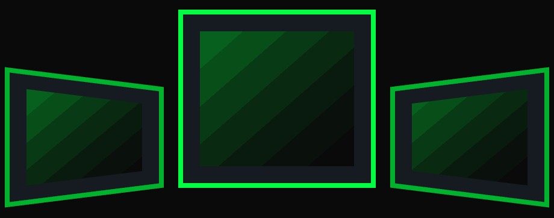
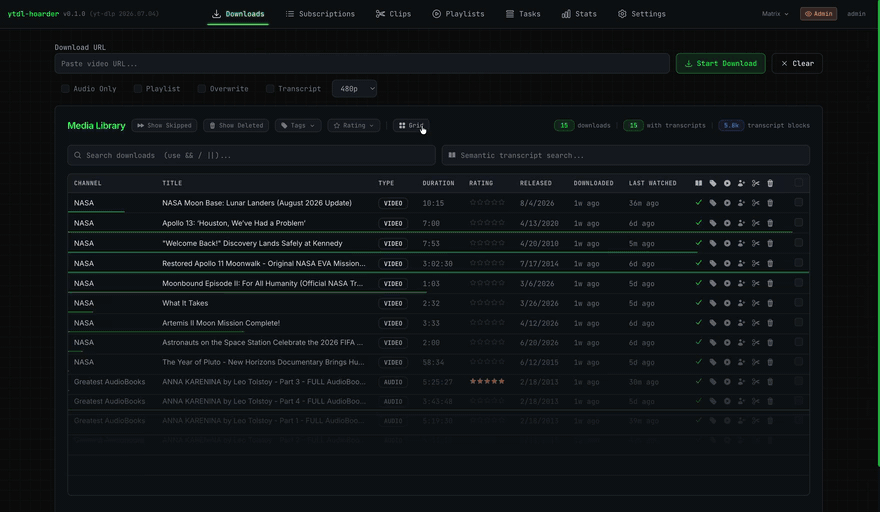
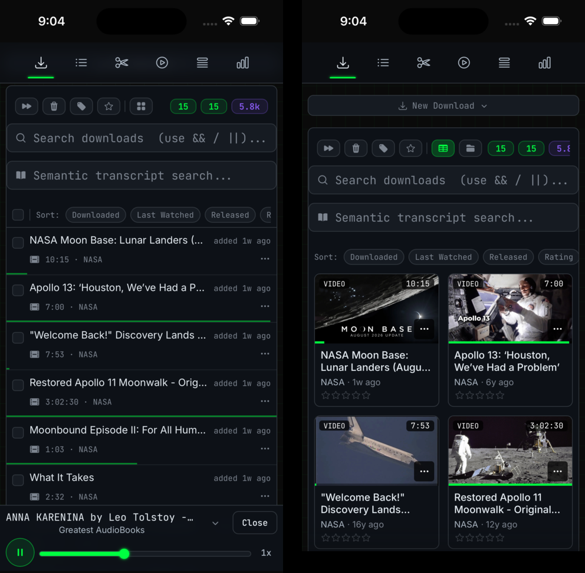

<!-- Screenshots & GIFs live in docs/images/. -->

<div align="center">



# ytdl-hoarder

**Self-hosted YouTube download manager with automatic subscriptions, local AI transcription, and search across the spoken content of your library.**


[](LICENSE)

</div>

Subscribe to channels and playlists and ytdl-hoarder keeps the library current on a schedule.
Downloads can be transcribed on-device with Whisper, which enables semantic search across the
collection, navigation to any spoken moment, clip extraction, playlist curation, and sharing with
other users on the instance. It runs entirely on your own hardware under Docker, with no external
accounts and no cloud dependency.

<div align="center">



</div>

## Features

| Feature | Description |
|---|---|
| **Automatic subscriptions** | Subscribe to channels and playlists; new uploads download on a schedule, filtered by title keyword, upload date, or duration, as audio-only or full video. |
| **Transcript search** | Items are transcribed locally with faster-whisper, embedded with onnxruntime, and stored in pgvector. Searches return the exact spoken passages and link to their timestamps, narrowed to whatever the library is currently filtered to — the search box, the open group folder, tag chips and minimum rating. |
| **Mobile-optimized interface** | The web UI is built for phones and tablets as well as desktop: card layouts in place of tables, touch drag-and-drop, mobile chart forms, and native video fullscreen and picture-in-picture on iOS. |
| **Waveform clipping** | Scrub an interactive waveform, drag region handles to frame-accurate start and end points, zoom for precision, and export a clip. |
| **Real-time progress** | Downloads and transcriptions stream progress over Server-Sent Events, reporting phase (video vs. audio), and percent complete.
| **Library organization** | Switch between table and grid views, group media into folders by channel, tag, or date, and rate and tag items. Hovering the progress bar shows sprite-based thumbnail previews. |
| **Playlists** | Build custom playlists with drag-and-drop ordering and play through them with next-up, shuffle, and autoplay controls. |
| **Statistics** | Storage breakdown, download trends over time, transcription coverage, and filterable engagement metrics. |
| **Multi-user and sharing** | Accounts with admin approval, per-user storage limits, and sharing of media, subscriptions, playlists, and clips. Media already downloaded by one user is granted to the next rather than downloaded twice. |
| **Boolean search** | The Downloads search box matches channel and title and supports `&&` (AND) and `\|\|` (OR); `&&` binds tighter. Single `&` and `\|` are matched literally. The operators narrow transcript search results too. |
| **70+ themes** | Built-in themes from retro terminal to modern light and dark palettes, switchable instantly. |
| **Audio visualizer** | Optional reactive visualizer behind the player bar for audio-only tracks, following the active theme's colors. Desktop only, to protect lock-screen playback on iOS. |

## On mobile

The same interface on a phone — the list and grid layouts, with the player docked at the bottom.

<div align="center">



</div>

## Installation

**Prerequisites:** [Docker](https://docs.docker.com/get-docker/) with Docker Compose v2, `openssl`,
either `curl` or `wget`, and disk space for your media. The default install pulls a prebuilt image,
so there is no build toolchain and nothing to compile. [Task](https://taskfile.dev/installation/) is
optional and adds shortcuts when working from a source checkout.

The published image is a multi-arch manifest covering x86-64 and ARM64, including Apple Silicon,
Raspberry Pi 5, and Graviton/Ampere servers. Transcription is CPU-bound and slower on ARM; consider a
smaller `transcription.whisper_model` there.

1. **Run the setup script:**

   ```bash
   wget https://raw.githubusercontent.com/kkuhlmann/ytdl-hoarder/main/setup.sh
   bash setup.sh
   ```

   There is no repository to clone. The script creates `./ytdl-hoarder/`, downloads the two Compose
   files it needs, prompts for media storage paths and the Whisper model and CPU threads, generates a
   JWT secret, writes `.env` and `config.yml`, then pulls the release image and starts the app.

   Every prompt has a corresponding flag for scripted setup (`--install-dir`, `--audio-path`,
   `--whisper-model`, `--image-tag`, and others; run `bash setup.sh --help` for the full list).
   `-y`/`--yes` accepts every default and performs a complete install in one command:

   ```bash
   bash setup.sh -y
   ```

2. **Open the UI and create an account:**
   - Published or prod mode: <http://localhost:8000> · Dev mode: <http://localhost:3000>
   - The first user to register becomes admin automatically. Subsequent users require admin approval.
   - API documentation (dev mode only): <http://localhost:8000/docs>

3. **Update:** from the install directory, run
   `docker compose -f docker-compose.published.yml pull && docker compose -f docker-compose.published.yml up -d`
   (or `task update` from a checkout). Updates are opt-in — a running container is never replaced
   until you pull — and this is also how new yt-dlp versions are picked up. All three modes share one
   Docker project, so the database and downloaded media survive switching between them.

<details>
<summary>Building from source</summary>

The published image covers both x86-64 and ARM64, so building is only needed to run modified code or
to contribute. It is the same script with two extra launch modes. Expect 20–45 minutes and several GB
of disk:

```bash
git clone https://github.com/kkuhlmann/ytdl-hoarder.git
cd ytdl-hoarder
bash setup.sh --launch build-prod   # or build-dev for :3000 + :8000 with hot reload
```

The `task` shortcuts (`task update`, `task db:backup`, `task admin:reset-password`) require the
checkout — they are unavailable in a `wget` install, which has no `Taskfile.yml`.

</details>

To configure the Compose files by hand instead of running `setup.sh`, see
[`docs/MANUAL_SETUP.md`](docs/MANUAL_SETUP.md).

## Usage

1. **Register** the first account, which becomes the administrator.
2. **Add content:** create a subscription for a channel or playlist, or paste a single video or
   playlist URL to download on demand.
3. **Monitor the Tasks tab** as downloads and optional transcription run. A pasted URL appears
   immediately as **Resolving** while its details are fetched.
4. **Open a download** in the built-in player. Playback position is saved per user, and transcribed
   items can be searched and navigated by transcript.
5. **Clip, collect, and share:** extract a clip on the waveform, add media to a playlist, and share
   any of it with other users on the instance.

| Tab | Purpose |
|-----|---------|
| **Downloads** | Browse the library, play media, search transcripts, create clips, rate and tag; switch to grid view and group into folders by channel, tag, or date |
| **Subscriptions** | Add and edit channel and playlist subscriptions and their filters |
| **Clips** | Manage clips created from your media |
| **Playlists** | Create and order playlists, play them through, and create clips from any track |
| **Tasks** | Monitor active downloads and transcription jobs. A submitted URL appears as **Resolving**, then **Queued** with the real title. Unreleased videos (live streams, upcoming premieres, post-live processing) appear as **Not Released**; subscriptions retry them automatically, one-off downloads must be re-added once the video airs. A task awaiting an automatic retry shows what failed and when it will retry (`HTTP 403 (3/20): Retries in 4m`) |
| **Stats** | Storage, download trends, and engagement metrics |
| **Settings** | Runtime configuration (admin only) |

### Download options

The toggles beside the URL box on the **Downloads** tab. They apply to that submission only.

| Option | What it does |
|---|---|
| **Audio Only** | Downloads audio instead of video, saved as m4a to the audio path. Also switches the quality selector to bitrate tiers. |
| **Playlist** | Treats the URL as a playlist and expands it into one download per video. Off, a `watch?v=…&list=…` URL downloads only the single video it points at. |
| **Overwrite** | Re-downloads a URL already in your library, replacing the existing copy and its transcript. Off, an already-downloaded URL is skipped. |
| **Transcript** | Transcribes the item with Whisper after it downloads, which is what makes it searchable by spoken content. |
| **Quality** | Caps the resolution — **Best** takes the highest available, otherwise the best format at or below the height you pick (1440p–360p). |
| **Quality** (audio-only) | Caps the bitrate. **Best** and **128 kbps** copy YouTube's native AAC stream untouched; 96/64/48 kbps re-encode down to hit the target. |

### Subscription options

Set per subscription when you add it, and editable afterwards. Subscriptions carry the same
**Audio Only**, **Overwrite**, **Transcript**, and **Quality** options as above, applied to every
video they download, plus filters deciding *which* videos qualify:

| Option | What it does |
|---|---|
| **Date filter** | Ignores anything released on or before this date, so a new subscription doesn't pull in a channel's entire back catalogue. |
| **Title filter** | Only downloads videos whose title contains this as a whole word, case-insensitive — `mix` matches "Mix" but not "remix". |
| **Min / Max duration** | Skips videos shorter or longer than the given number of **minutes**. Useful for excluding Shorts, or multi-hour streams. |
| **Enabled** | The switch on each row in the Subscriptions table. Pauses checking without deleting the subscription or anything it downloaded. |

Filtered-out videos are recorded as skipped rather than re-examined every cycle. Loosening a filter
later re-evaluates them, so widening a duration range or clearing a title filter picks up the videos
it previously passed over. How often subscriptions are checked is set in **Settings**, not here.

## Configuration

`setup.sh` configures the essentials. To change them later, edit `config.yml` and restart:

- **Storage paths** — where audio and video are saved on the host (`.env`: `AUDIO_ONLY_PATH`,
  `VIDEO_PATH`)
- **Whisper model** — `tiny.en` (fast, ~1 GB) up to `large` (best, ~10 GB)
  (`transcription.whisper_model`)
- **Release version** — `.env`: `YTDL_HOARDER_TAG`, `latest` by default; pin it to hold a version
  through updates

`config.yml` is the single source of application settings and is documented in full in
[`config.sample.yml`](config.sample.yml). `.env` is Docker Compose's variable file and is never read
by the application. Download throttling, yt-dlp player-client order, subscription check interval,
task lane concurrency, and several other settings are editable live from the **Settings** tab and
take effect on the next task without a restart.

See [`docs/CONFIGURATION.md`](docs/CONFIGURATION.md) for the throttling knobs, live settings
semantics, release pinning, and dev-mode networking.

## Troubleshooting

See [`docs/TROUBLESHOOTING.md`](docs/TROUBLESHOOTING.md) for the full list, including password
recovery. The two most common issues:

- **Downloads fail or return empty files.** Update the image to get a newer yt-dlp (`task update`, or
  `docker compose -f docker-compose.published.yml pull && docker compose -f docker-compose.published.yml up -d`).
  This resolves the problem more often than any setting change.
- **Locked out of the only admin account.** Use *Admin account recovery* on the sign-in page, which
  writes a single-use code to `data/admin-recovery.txt` on the server, or run
  `task admin:reset-password -- <username>` with shell access.

## Development

[`CONTRIBUTING.md`](CONTRIBUTING.md) covers the dev setup — run `bash script/bootstrap.sh` (or
`task setup:dev`) to install the optional host tooling (uv and dependencies, node dependencies, task,
deno). Architecture, task orchestration, and conventions are documented in [`AGENTS.md`](AGENTS.md).

```bash
# Backend (Python 3.14, managed with uv)
cd backend
uv sync              # install dependencies
uv run pytest        # run tests
uv run ruff format . # format
uv run ruff check .  # lint

# Frontend (Next.js 16 / React 19)
cd frontend
npm install
npm run dev          # dev server
npm run build        # production build (Turbopack)
npm run lint         # eslint flat config; `next lint` was removed in Next 16
```

With [Task](https://taskfile.dev/) installed, `task published` / `task up` / `task down` /
`task logs` run the stack, `task update` pulls a newer release, `task db:shell` opens psql, and
`task tasks:runtime` shows the orchestrator's queued and running jobs. Run `task --list` for the
full set.

**Stack:** Python 3.14 · FastAPI · SQLModel · PostgreSQL + pgvector · yt-dlp · faster-whisper ·
onnxruntime on the backend; Next.js 16 · React 19 · TypeScript · Tailwind CSS on the frontend; Docker
and Alembic for infrastructure. An in-process task orchestrator runs four lanes (default,
subscriptions, downloads, ml) inside the backend, with no separate broker or worker processes.

## Support

ytdl-hoarder is free, open source, and built in my spare time. If it's useful to you, a ⭐ on GitHub
helps more than you'd think. And if you'd like to buy me a coffee, it's genuinely appreciated —
never expected.

<div align="center">

<a href="https://buymeacoffee.com/ytdl.hoarder"></a>

</div>

## License

[GNU AGPL v3.0](LICENSE) — running a modified version of ytdl-hoarder as a network service requires
making the source of your modifications available to its users.

The published Docker images include GPL-licensed `ffmpeg`/`ffprobe` binaries from
[yt-dlp/FFmpeg-Builds](https://github.com/yt-dlp/FFmpeg-Builds); their source and licenses are
available at that repository. The download helper is adapted from
[tubearchivist](https://github.com/tubearchivist/tubearchivist) (GPL-3.0).
